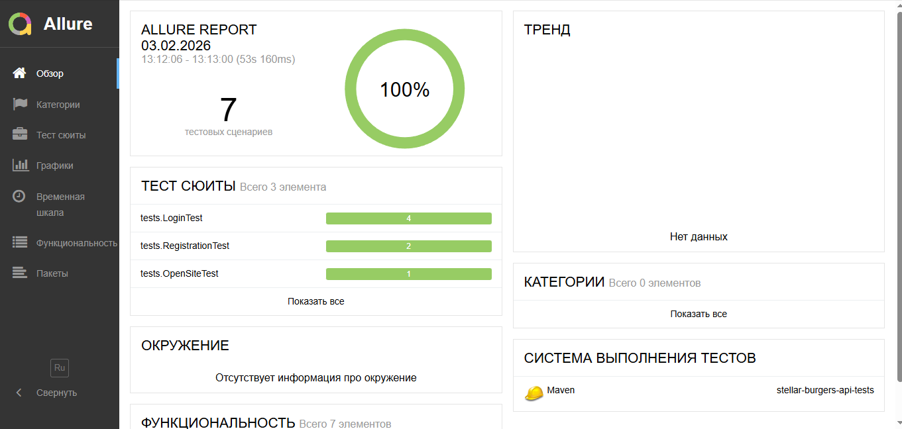
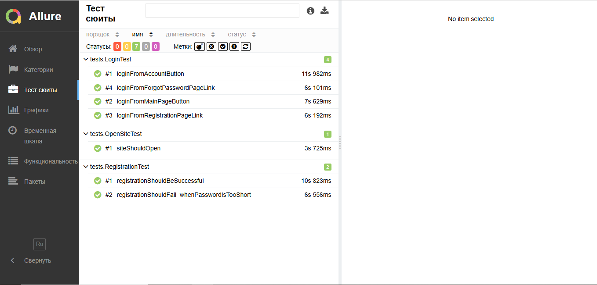

## Запуск тестов

### Все тесты (Chrome по умолчанию)
mvn clean test

### Запуск в Яндекс.Браузере
mvn clean test "-Dbrowser=yandex" "-Dyandex.binary=%LOCALAPPDATA%\Yandex\YandexBrowser\Application\browser.exe"

## Allure отчёт

1) Запусти тесты (создастся папка с результатами):
   mvn clean test

2) Открой отчёт (локально поднимется сервер Allure):
   mvn allure:serve

### Где лежат результаты и отчёт
- Результаты: `target/allure-results`
- Отчёт (если нужно собрать статически):  
  `mvn allure:report`  
  и он появится в `target/site/allure-maven-plugin`

